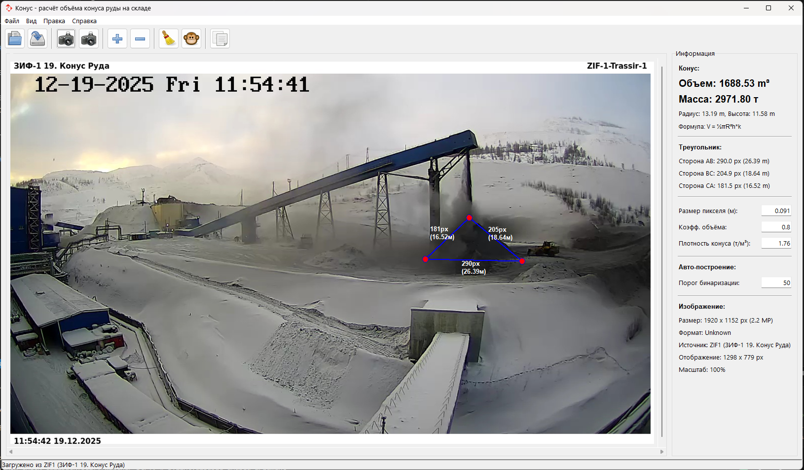

# Cone App


[](https://www.python.org/downloads/)
[](LICENSE)
[](https://github.com/SemonoffArt/cone)

Графическое приложение для **расчёта объёма и массы конуса руды по данным видеоаналитики**. Программа интегрируется с системой видеонаблюдения Trassir, автоматически загружает снимки с камер, строит модель конуса по треугольнику на изображении и рассчитывает объём и массу руды с учётом калибровочных коэффициентов.


---

## Основная идея 💡

Запрос на автоматизацию расчёта объёма и массы конусов руды поступил от руководства ЗИФ. 

Цель приложения — дать технологам и руководству **быстрый и наглядный инструмент** для оценки запасов руды на складах с использованием существующей системы видеонаблюдения.

---

## Возможности ✨

- 📸 **Работа с изображениями и камерами Trassir**
  - Загрузка изображений из локальных файлов
  - Прямая интеграция с системой видеонаблюдения Trassir
  - Автоматическая загрузка скриншотов с камер "Конус ЗИФ1" и "Конус ЗИФ2"
  - Отображение параметров изображения: размер, формат, источник, масштаб

- 🎯 **Построение треугольника и моделирование конуса**
  - Рисование треугольника на изображении по трём точкам
  - Перетаскивание вершин треугольника мышью для точной подгонки
  - Подсветка вершин при наведении курсора
  - Автоматический режим распознавания конуса (алгоритм компьютерного зрения)
  - Сохранение формы треугольника при обновлении изображения

- 📐 **Расчёт объёма и массы конуса**
  - Расчёт объёма конуса по формуле: **V = ⅓πR²h * k_vol**
  - Расчёт массы руды: **m = V × k_den**
  - Определение радиуса основания и высоты конуса
  - Отображение длин сторон треугольника в пикселях и метрах
  - Учёт:
    - размера пикселя камеры (pixel_size_m)
    - коэффициента объёма (k_vol)
    - коэффициента плотности руды (k_den)

- 🔍 **Масштабирование и навигация**
  - Масштабирование изображения с клавишами `+` и `-`
  - Автоматическая подстройка окна под размер изображения
  - Прокручиваемый холст с горизонтальной и вертикальной прокруткой

- 💾 **Работа с данными**
  - Копирование **объёма и массы** конуса в буфер обмена
  - Формат для Excel: `объём[TAB]масса` с **запятой** в качестве десятичного разделителя (например: `123,45\t210,78`)
  - Отображение подробной информации об изображении и расчётах
  - **Сохранение изображений с аннотациями:**
    - Наложение треугольника с вершинами на сохраняемое изображение
    - Подписи сторон треугольника с размерами в пикселях и метрах
    - Метаданные в левом нижнем углу:
      - Дата и время сохранения
      - Тип конуса (ЗИФ1/ЗИФ2)
      - Объём, масса, радиус и высота конуса
      - Параметры расчёта: размер пикселя, коэффициент объёма, плотность
    - Полупрозрачные фоны для читаемости текста

- 🎨 **Пользовательский интерфейс**
  - Меню: `Файл`, `Вид`, `Правка`, `Справка`
  - Панель инструментов с иконками и подсказками
  - Информационная панель с параметрами треугольника, конуса и изображения
  - Строка состояния с понятными сообщениями о текущих действиях
  - **Окно настроек** (`Файл → Настройки`):
    - Редактирование всех параметров камер ЗИФ1 и ЗИФ2
    - Настройка IP-адресов Trassir, имён каналов
    - Калибровка размера пикселя, коэффициентов объёма и плотности
    - Настройка областей ROI и центров конусов
    - Сохранение в `config.json` или восстановление значений по умолчанию

---

## Требования 📋

- **Python:** 3.13 или выше
- **Операционная система:** Windows (разработка и основная эксплуатация)
- **Опционально:** сервер Trassir для интеграции с камерами видеонаблюдения

### Зависимости

```bash
pillow>=12.0.0      # Обработка изображений
requests>=2.32.5    # HTTP-запросы (для Trassir)
```

---

## Установка 🚀

### 1. Клонируйте репозиторий

```bash
git clone https://github.com/SemonoffArt/cone.git
cd cone
```

### 2. Установите Python 3.13+

Скачайте установщик с сайта [python.org](https://www.python.org/downloads/) и убедитесь, что Python добавлен в `PATH`.

### 3. Установите зависимости

С использованием `uv` (рекомендуется):

```bash
uv sync
```

Или с использованием `pip`:

```bash
pip install pillow>=12.0.0 requests>=2.32.5
```

### 4. Запуск приложения

```bash
python main.py
```

При старте приложение автоматически загружает изображение "Конус ЗИФ1" (при корректно настроенном Trassir) и подстраивает размер окна под изображение.

---

## Использование 🎮

### Загрузка изображений

**Из файла:**
- Меню: `Файл → Открыть`
- Панель инструментов: иконка папки

**С камер Trassir:**
- Меню: `Файл → Конус ЗИФ1` или `Файл → Конус ЗИФ2`
- Панель инструментов: иконки камер

### Построение треугольника

1. Нажмите последовательно 3 точки на изображении (две нижние точки основания и верхняя точка конуса).
2. В строке состояния отображается прогресс: "Добавлена вершина 1/3", "2/3", "3/3".
3. После построения можно перетаскивать вершины мышью.

### Автоматическое распознавание конуса

- Меню: `Правка → Автоматически построить треугольник`
- Панель инструментов: кнопка с иконкой "авто" (🤖)
- Программа автоматически распознаёт контур конуса и предлагает треугольник, который можно при необходимости подправить вручную.

### Просмотр результатов

**Информационная панель** показывает:
- **Объём конуса** (м³)
- **Массу руды** (т)
- Радиус и высоту конуса
- Длины сторон треугольника в пикселях и метрах
- Параметры изображения (размер, формат, источник, масштаб)

### Копирование объёма и массы

1. Постройте треугольник (вручную или автоматически).
2. В меню: `Правка → Скопировать объём и массу конуса` или используйте кнопку на панели инструментов.
3. В буфер обмена копируется строка формата: `объём\tмасса` с запятой как десятичным разделителем (например: `123,45\t210,78`).
4. Вставьте данные в Excel — объём и масса попадут в отдельные ячейки.

### Настройка параметров расчёта

На информационной панели доступны:
- **Размер пикселя (м)** — калибровка под конкретную камеру;
- **Коэффициент объёма (k_vol)** — поправка на форму конуса;
- **Коэффициент плотности (k_den)** — плотность руды (т/м³);
- **Порог бинаризации** — для автоматического распознавания контура конуса.

Изменение любого из полей автоматически приводит к перерасчёту объёма и массы.

### Окно настроек

Для полной настройки параметров камер используйте окно настроек:

1. **Открытие:** `Файл → Настройки`
2. **Вкладки:** Отдельные вкладки для "Конус ЗИФ-1" и "Конус ЗИФ-2"
3. **Параметры:**
   - IP адрес Trassir
   - Имя канала
   - Размер пикселя (м)
   - Коэффициент объёма
   - Плотность (т/м³)
   - Порог бинаризации
   - ROI (область интереса) в формате `[x1, x2, y1, y2]`
   - Центр конуса в формате `[min%, max%]`
4. **Действия:**
   - **Сохранить** — запись параметров в `config.json`
   - **По умолчанию** — восстановление значений из `constants.py`
   - **Отмена** — закрытие без сохранения

### Сохранение изображений с аннотациями

При сохранении изображения (`Файл → Сохранить` или иконка дискеты) на изображение автоматически накладываются:

**На треугольнике:**
- Линии и вершины треугольника
- Подписи сторон с размерами: `AB: 450px (40.95м)`

**В левом нижнем углу (на полупрозрачном фоне):**
```
2025-12-17 10:45:30

Конус ZIF1
Объём: 245.67 м³
Масса: 432.38 т
Радиус: 8.50 м
Высота: 3.45 м

------------------------------
Размер пикселя: 0.0910 м
Коэффициент объёма: 0.80
Плотность: 1.76 т/м³
```

Это позволяет создавать готовые отчёты с полной информацией о измерениях.

---

## Управление конфигурацией ⚙️

### Файл конфигурации

При первом запуске приложение создаёт файл `config.json` в каталоге программы на основе значений из `utils/constants.py`. 

**Автоматическое управление версиями:**
- При запуске сравнивается версия в `constants.py` и `config.json`
- Если версия в `constants.py` выше — `config.json` перезаписывается новыми значениями
- Если версия равна или ниже — используется существующий `config.json`

**Автосохранение:**
- Все изменения в полях информационной панели автоматически сохраняются в `config.json`
- Настройки из окна "Настройки" сохраняются при нажатии кнопки "Сохранить"

### Интеграция с Trassir 🎥

Параметры камер по умолчанию задаются в `utils/constants.py` и могут быть изменены через окно настроек:

```python
CAM_CONE_ZIF1 = {
    "chanel_name": "ЗИФ-1 19. Конус Руда",
    "trassir_ip": "10.100.59.10",
    "pixel_size_m": 0.091,
    "roi": [1125, 1545, 345, 615],
    "cone_center": [45, 65],
    "threshold": 50,
    "k_vol": 0.8,
    "k_den": 1.76,
}

CAM_CONE_ZIF2 = {
    "chanel_name": "ККД-2 115. Конус",
    "trassir_ip": "10.100.72.14",
    "pixel_size_m": 0.16,
    "roi": [716, 1180, 170, 360],
    "cone_center": [40, 60],
    "threshold": 85,
    "k_vol": 0.55,
    "k_den": 1.76,
}
```

Приложение по запросу подключается к серверу Trassir, получает скриншот с соответствующего канала и отображает его в главном окне.

**Автоматическое масштабирование:**
- Все скриншоты с Trassir автоматически масштабируются до ширины 1920px с сохранением пропорций
- Это обеспечивает единообразие и корректную работу калибровочных коэффициентов

---

## Структура проекта 📁

```text
cone/
├── core/
│   ├── cone_calculator.py    # Логика расчёта объёма и массы конуса
│   ├── geometry.py           # Геометрические расчёты
│   ├── vision.py             # Алгоритмы компьютерного зрения
│   └── triangle.py           # Управление вершинами треугольника
├── ui/
│   ├── main_window.py        # Главное окно приложения
│   ├── info_panel.py         # Информационная панель
│   ├── settings_dialog.py    # Окно настроек камер
│   ├── toolbar.py            # Панель инструментов
│   └── menu.py               # Меню приложения
├── utils/
│   ├── constants.py          # Константы и параметры камер по умолчанию
│   ├── config.py             # Управление конфигурацией (config.json)
│   ├── trassir.py            # Интеграция с Trassir
│   └── logger.py             # Логирование
├── resources/                # Иконки и графические ресурсы
├── doc/                      # Документация и материалы презентации
├── main.py                   # Точка входа
├── config.json               # Файл конфигурации (создаётся автоматически)
├── pyproject.toml            # Конфигурация проекта
└── .gitignore                # Игнорируемые файлы (включая config.json)
```

---

## Формула расчёта 📐

Расчёт объёма конуса выполняется по формуле:

```text
V = (1/3) × π × R² × h × k_vol
m = V × k_den
```

Где:
- **R** — радиус основания конуса (половина длины нижней стороны треугольника),
- **h** — высота конуса (расстояние от основания до вершины),
- **k_vol** — коэффициент объёма,
- **k_den** — плотность руды (т/м³).

---

## Автор 👤

**Семёнов Артемий**

- Портфолио: https://semonoffart.github.io/
- GitHub: https://github.com/SemonoffArt
- Репозиторий проекта: https://github.com/SemonoffArt/cone

---

**Cone App** — рабочий инструмент для производственников, созданный специально для задач оперативного контроля запасов руды на складах.